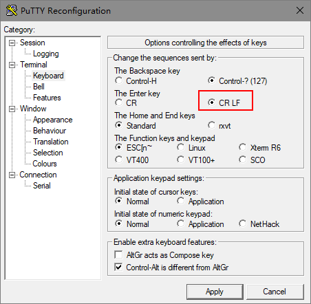
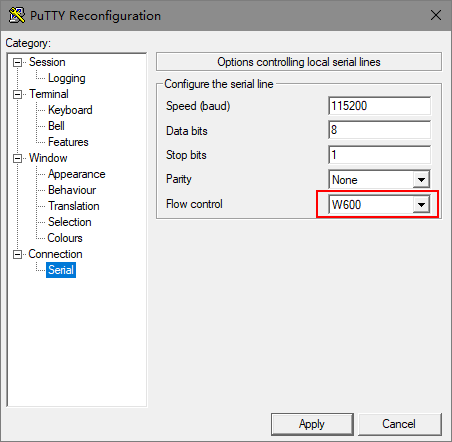

# putty for tb-01

本项目中的 [PUTTY.exe](./PUTTY.exe) 使用 VS2012 进行了重新编译，

请参照官方源码进行对比: http://www.chiark.greenend.org.uk/~sgtatham/putty/

## 特性

* 支持 CRLF 发送

* 支持 TB-01

## TODO

* 一键复位

* 一键下载

* 一键擦除

## 说明

支持回车+换行:

使用 TB-01 时，流控需修改为 W600，否则 W600 的 RST 会被串口芯片的 RTS 拉低，导致W600无法启动，串口会没有输出。

## 参考

https://github.com/gniemirowski/putty-crlf

https://github.com/kexiaodong/CPShell

